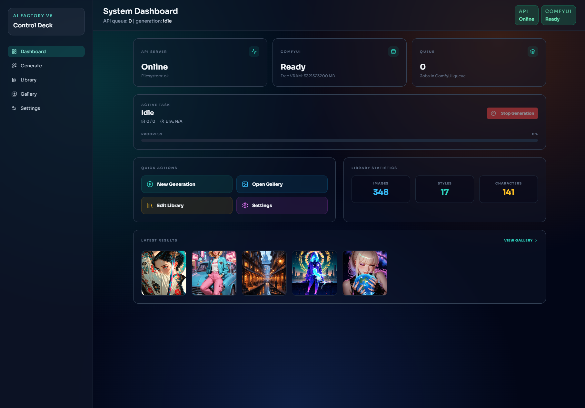
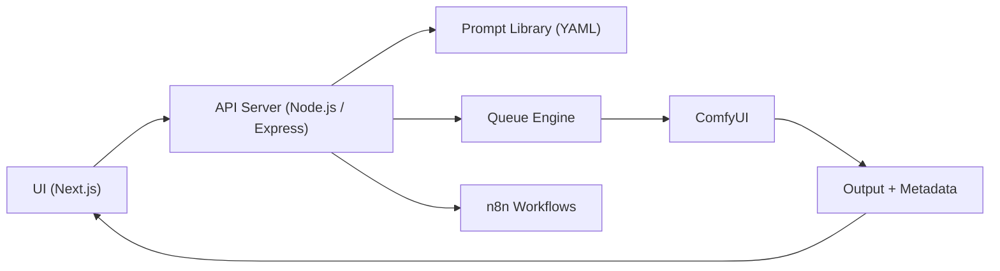

# RC Lab

RC Lab — система пакетной генерации изображений с модульной сборкой промптов, очередью задач и orchestration-слоем на базе `n8n`, `ComfyUI`, `Node.js` и `Next.js`.

## Что умеет

- модульная сборка промптов из semantic-компонентов
- batch-генерация через очередь
- интеграция с ComfyUI
- мониторинг статуса генерации в реальном времени
- галерея результатов и работа с metadata
- управление библиотекой компонентов через UI

## Архитектура

## Workflow Overview

```mermaid
flowchart LR
    A["Trigger"] --> B["Загрузка входных данных"]
    B --> C["Проверка кеша / разведка"]
    C --> D["Сборка prompt-модулей"]
    D --> E["Подготовка ComfyUI payload"]
    E --> F["Запуск генерации"]
    F --> G["Проверка статуса / ожидание"]
    G --> H["Сохранение metadata"]
    H --> I["Скачивание результата"]
    I --> J["Публикация / уведомление"]
```

Реализация workflow лежит в [ai-factory-n8n/n8n_workflow_v6.json](/Users/developer/MyProjects/rc-lab/ai-factory-n8n/n8n_workflow_v6.json).

## Стек

- Next.js
- React
- TypeScript
- Node.js
- Express
- n8n
- ComfyUI
- Tailwind CSS
- shadcn/ui
- Zustand
- WebSocket (`ws`)

## Структура проекта

- `ai-factory-ui` — веб-интерфейс для генерации, галереи, библиотеки и настроек
- `api-server` — API и orchestration-логика
- `ai-factory-n8n` — workflow, queue и публичные placeholder-папки для `library/` и `presets/`
- `docs` — документация и скриншоты

## Быстрый старт

1. Установить зависимости в `api-server` и `ai-factory-ui`.
2. Вручную создать `api-server/.env` и `ai-factory-ui/.env.local`.
3. Настроить `FACTORY_ROOT`, `COMFY_API`, `COMFY_OUTPUT` и `API_TOKEN`.
4. Запустить API-сервер и UI локально.

Подробная инструкция: [QUICKSTART.md](/Users/developer/MyProjects/rc-lab/QUICKSTART.md)

## Ключевые идеи проекта

- декомпозиция prompt'ов на переиспользуемые semantic-модули
- разделение orchestration и inference
- файловая библиотека компонентов вместо жёстко зашитых сценариев
- batch-first подход к генерации
